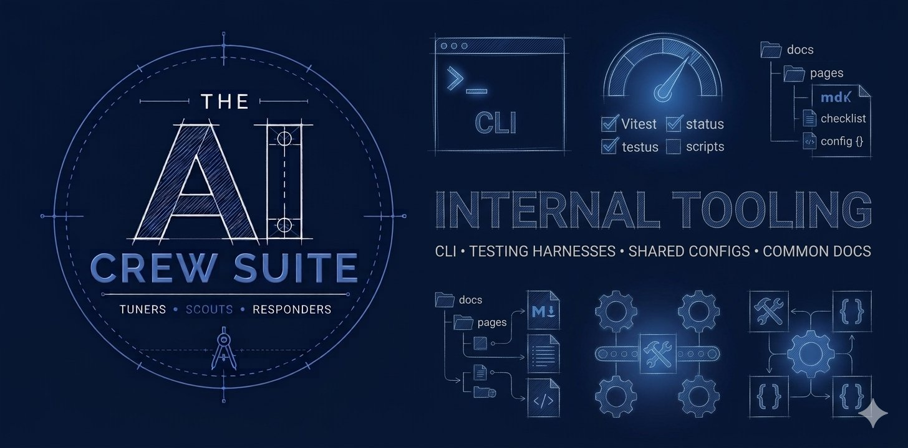

# AI Crew Suite for Spotify Backstage IDP - Infrastructure



AI Crew Suite is a Backstage plugin workspace for building retrieval-augmented, tool-using AI agents inside a developer portal. This repo includes tooling to support other repos: the Crew CLI, test helpers, and infrastructure to keep lint, TypeScript, test, and project documents like contribution guidelines in sync.

> [!WARNING]
> This repo is pre-beta and under going heavy development as of October, 2026. We are refactoring from LangGraph to a fluent API for workflows in agentic plugins based on Temporal + Mem0 Vercel AI SDK.

## 🏗️ Development Workflow

This repository is a Backstage monorepo using Yarn 4 Plug'n'Play, Turbo, TypeScript project references, and package-local plugin builds.

**Prerequisites:**

- Node.js `>=22.22.2`
- Yarn `4.17.1`, as declared by `packageManager`

### 1. Installation & Builds

Run installation routines and build compilation tracks directly from the monorepo root so Yarn PnP and workspace references resolve correctly:

```bash
# optional refresh flag forces full install if wanted
yarn install --refresh
yarn turbo run build
```

### 2. Running Unit & Integration Tests

```bash
yarn turbo run lint
yarn turbo run test:unit
```

### 3. Run Scripts in a Single Package

Add a `--filter`  flag to the command:

```bash
yarn turbo run test:unit --filter=@ai-crew-suite/plugin-kernel-backend
```

### 4. Adding Packages

This repo sets `enableImmutableCache` to `true` in `.yarnrc.yml` for compliance with FINRA, SOC-2, and HIPAA enterprise environments. This enforces cryptographic reproducibility and supply-chain immutability in the repo. It also blocks adding or upgrading package versions locally. Renovatebot handles this automatically by executing Yarn in a mode equivalent to `--mode=update-lockfile`. To add a package locally:

```bash
YARN_ENABLE_IMMUTABLE_CACHE=false yarn install
```

## Publish

- View your active configuration: `npm config list`
- Set a configuration value: `npm config set registry <url>`
- Delete a configuration: `npm config delete <key>`
- Open your user config file in your text editor: `npm config edit`

## 📚 Documentation

When adding or changing a core backend module, update the matching package README and the relevant page in the [documentation site repo](https://github.com/ai-crew-suite/documentation).

## 🚀 Release & Publication Management

Publish a new version:

```bash
yarn turbo run publish
```

- Proxies `yarn changeset publish` to orchestrate multi-package version increments.
- Integrates seamlessly with the npm/Yarn lifecycle hooks (`prepack` / `postpack`) declared inside individual frontend and backend plugins, ensuring distribution tarballs carry fully compiled, production-ready path definitions during registry deployment passes.

## 🔊 Get involved

### Issues and Discussions

Please open a [Discussion](https://github.com/ai-crew-suite/infra/discussions) to get help, suggest a new feature, or to report a bug. We only want maintainers to open Issues.

- [GitHub Discussions for AI Crew Suite Infra](https://github.com/ai-crew-suite/infra/discussions)

### Contributing

To contribute to AI Crew Suite, please read the contributing guidelines.

- [Guidelines for Contributing](https://github.com/ai-crew-suite/infra/blob/main/.github/CONTRIBUTING.md)

### Contact and Social Media

The AI Crew Suite project is proudly supported and actively maintained by Webstack Builders.

- Contact [Webstack Builders](https://webstackbuilders/contact/) for commercial support questions.

Follow us on:

- BlueSky: [social@ai-crew-suite.dev](https://ai-crew-suite.bsky.social)
- LinkedIn: [linkedin.com/company/ai-crew-suite](https://linkedin.com/company/ai-crew-suite)

## 🛡️ Security / Disclosure

If you find any bug with AI Crew Suite that may be a security problem, please report it through the [GitHub Security Advisories process](https://github.com/ai-crew-suite/infra/security/advisories). This way we can evaluate the bug and hopefully fix it before it gets abused. Please give us enough time to investigate the bug before you report it anywhere else.

If you would like to discuss a potential finding before raising the Advisory, then e-mail us at [security@ai-crew-suite.dev](mailto:security@ai-crew-suite.dev).

## ©️ Compliance and Licensing

Copyright © 2026 The AI Crew Suite Authors.
Licensed under the **Apache License, Version 2.0**.
