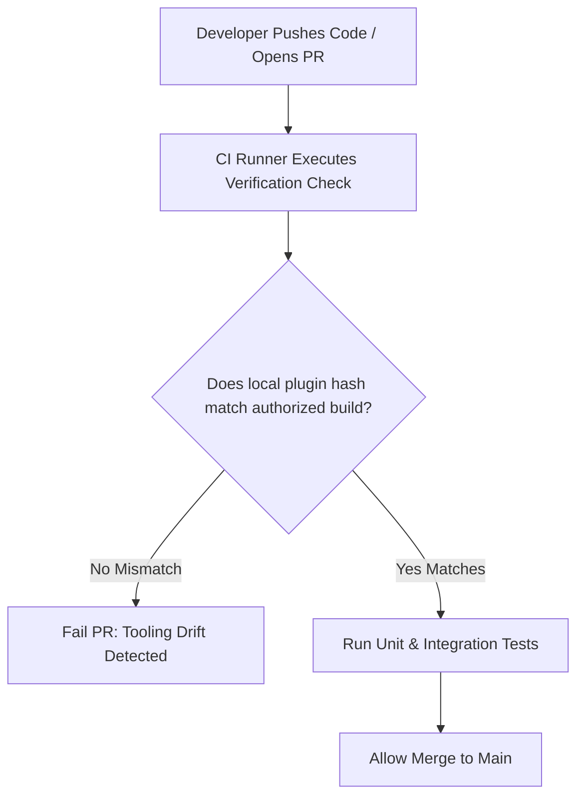

# Managing Yarn Plugins

Yarn plugins are written in TypeScript/JavaScript and utilize the `@yarnpkg/core` APIs.

- `plugin-backstage.cjs`: Used to resolve `backstage:^` dependency versions from `backstage.json` files.

## Step 1: Building a Plugin

Yarn provides a official template repository to bootstrap plugin development.

1. Clone the Yarn Plugin Template.
2. Write your logic using Yarn hooks (e.g., intercepting the dependency resolution setup) or by registering new commands using the `clipanion` command library built into Yarn.
3. Build the plugin. The build process compiles your code into a **single, self-contained `.cjs` file** (using tools like Webpack or esbuild) so it has zero external runtime dependencies.

## Step 2: Versioning and Maintenance

- **Semantic Versioning:** You maintain your plugin source code in its own separate Git repository. You version it like a standard package (using `package.json` versions).
- **Release Artifacts:** When you release a new version (e.g., `v1.2.0`), your CI/CD pipeline should build the single `.cjs` file and attach it as a **release asset** on GitHub or publish it to a registry.

## Step 3: Distribution

There are two main ways to distribute your plugin to your team or the public:

| Method | How Users Install It | Best For |
| --- | --- | --- |
| **URL-Based (GitHub Releases)** | `yarn plugin import https://github.com` | Internal company tools or private plugins. |
| **NPM Registry** | `yarn plugin import my-yarn-plugin-package` | Open-source public plugins. Yarn will look for a package on npm and extract the compiled `.cjs` bundle. |

Once a consumer runs the `yarn plugin import` command, Yarn updates their `.yarnrc.yml` file and downloads the `.cjs` file directly into their project's `.yarn/plugins/` directory.

## RenovateBot

Yarn Modern allows you to declare plugins using standard npm package names. Instead of pinning to a static `.cjs` path, you can specify your custom plugin like this in your **`.yarnrc.yml`**:

```yaml
plugins:
  - name: my-yarn-plugin-package
    spec: "my-yarn-plugin-package@^1.0.0"
```

1. **Renovate Support:** Renovate natively understands `.yarnrc.yml` plugin definitions that use the `spec` field.
2. **The Automation:** When you publish a new version of `my-yarn-plugin-package` to npm, Renovate will detect the version bump, update the `spec` string in your `.yarnrc.yml`, and trigger its artifact updater.
3. **Under the Hood:** During that update step, Yarn resolves the new version from npm, automatically downloads the new `.cjs` payload, and updates the local cached plugin file.

## How are Yarn plugins normally distributed?

Yarn custom plugins are distributed as **a single, self-contained, bundled JavaScript file** (typically named `plugin-name.cjs` or `index.js`).

Because Yarn must be able to load the plugin *before* running an install, the plugin cannot rely on a local `node_modules` folder. At build time, tools like **Esbuild**, **Webpack**, or **Rollup** are used to compile the source TypeScript code and deeply inline all third-party dependencies (like `npm-package-arg`) into that single file.

From there, organizations distribute the bundled file using one of three methods:

- **Committed directly to the Repository:** The `.cjs` bundle is placed in a folder like `.yarn/plugins/` inside the monorepo and checked into Git. This is the most common pattern for internal corporate plugins.
- **Published to an npm Registry:** The plugin project is published as a standard npm package containing the `.cjs` file. Teams run `yarn plugin import <package-name>` to pull it down.
- **Hosted via a static HTTP Server/URL:** The bundle is uploaded to an internal static bucket (S3, Artifactory, or GitHub Releases), and fetched via a direct URL.

## Version-Tagged Filenames (`yarn-plugin-custom-add-v1.2.0.cjs`)

The filename includes the semantic version, and `.yarnrc.yml` updates its `plugins` path array to match.

- **Pros:** **Deterministic, cache-safe, and auditable.** Every time you bump the plugin version, the path in `.yarnrc.yml` changes. Git history explicitly shows when the tool was upgraded, matching SOC-2 and FINRA change-management criteria. It guarantees that every developer and CI runner is forced to use the exact same version on that branch.
- **Cons:** Requires a coordinated commit that drops the new file *and* updates the `.yarnrc.yml` configuration string simultaneously.

## Are End-to-End (E2E) and Integration Tests Common?

Yes. While unit tests with mocks are great for fast local feedback loop validation, **integration tests are highly critical for Yarn plugins** because you are executing logic against the raw, underlying state of the filesystem and lockfile.

In enterprise environments, standard integration testing involves a **Fixture-based Test Suite**:

1. The test harness sets up a temporary, sandboxed directory on the host machine.
2. It copies realistic target mock files (`package.json`, `.yarnrc.yml`) into the sandbox.
3. It invokes Yarn using a real child-process execution (e.g., `execa` or `child_process.execSync`), registering your compiled `.cjs` plugin asset.
4. It asserts that the exit codes match expected limits, and reads back the modified sandbox files using an actual parser to ensure no text corruption occurred.

Without this, an upstream change in Yarn's internal API can pass your unit tests but crash in production.

## What is the normal installation process?

For a consumer of the plugin inside the monorepo, the installation process depends on your distribution layer:

### Method A: If distributed via npm or URL

The user executes Yarn's native plugin manager command:

```bash
yarn plugin import @ai-crew-suite/yarn-plugin-custom-add
# OR via a direct asset URL
yarn plugin import https://internal-binaries.corp
```

This automatically downloads the bundle, places it into your local repository's `.yarn/plugins/` directory, and appends the registration path block to your root `.yarnrc.yml` asset.

### Method B: If committed directly to Git (Monorepo standard)

No installation step is needed for developers. The automated release pipeline drops the `.cjs` asset directly into `.yarn/plugins/` and updates the `.yarnrc.yml` reference. When a developer runs `git pull`, the new plugin is instantly active and live on their machine.

## Standard CI Workflow for Managing the Upgrade Process

Your observation is completely accurate: **Yarn plugins are notoriously prone to version drift across developer environments.** If a developer is running an old version of a custom add command, they can accidentally commit un-sorted or un-cataloged dependencies, breaking baseline validation rules.

To solve this, enterprise monorepos implement a **Enforcement & Auto-Upgrade CI Workflow**:



### Step 1: The Integrity Verification Script

Add a simple bash or node script to your CI pipeline (`yarn run lint:plugins`) that runs on every single pull request. This script checks that the local plugin matches the source code:

```bash
# Calculate the cryptographic hash of the compiled plugin checked into git
LOCAL_HASH=$(sha256sum .yarn/plugins/@ai-crew-suite/plugin-custom-add.cjs | awk '{print $1}')

# Build a temporary copy in memory from the latest source folder code
yarn workspace @ai-crew-suite/yarn-plugin-custom-add build --output /tmp/verified.cjs
EXPECTED_HASH=$(sha256sum /tmp/verified.cjs | awk '{print $1}')

if [ "$LOCAL_HASH" != "$EXPECTED_HASH" ]; then
  echo "❌ Error: Tooling drift detected. The custom add plugin bundle is out of sync with its source code."
  echo "Please run 'yarn workspace @ai-crew-suite/yarn-plugin-custom-add build' and commit the updated bundle asset."
  exit 1
fi
```

### Step 2: Automated Semantic Releases

When a change is merged into the plugin's source code folder on your `main` branch, a semantic release step (like GitHub Actions with Semantic Release) triggers:

1. It automatically increments the plugin version based on conventional commits.
2. It builds the clean, minified production `.cjs` bundle.
3. It automatically opens a **Pull Request back against the repository** that drops the new `plugin-vX.X.X.cjs` asset into place and updates `.yarnrc.yml`.

This guarantees that tooling upgrades are explicit, visible, automated, and tightly controlled.
