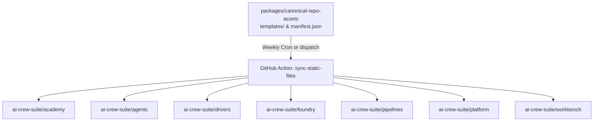

# Synchronize Static Files Across Repositories

Centralized static repository assets, governance templates, and synchronization manifest for the AI Crew Suite platform.

## Overview

This package serves as the single source of truth for repository configurations, development toolchain presets, governance documentation, and AI agent guardrails across the AI Crew Suite ecosystem. It maintains both the canonical copies of shared files and a declarative manifest (`manifest.json`) that dictates how these assets are synchronized into downstream repositories.

Synchronization is performed automatically via GitHub Actions workflows (such as the Framework Alignment Validation workflow in the Foundry repository), which invoke the `ai-crew-suite/pipelines/actions/sync-static-files` action to open automated pull requests across all participating repositories whenever canonical templates change.

## Core Responsibilities

- **Single Source of Truth**: Eliminates configuration drift by defining shared files (such as root dotfiles, IDE settings, and governance documents) once in this central repository rather than duplicating them manually.
- **Declarative Synchronization**: Defines granular, repository-specific file distribution matrices in `manifest.json` specifying exact source template paths and destination targets.
- **Governance and Compliance Alignment**: Enforces uniform community health, open-source standards, and security policies (including `CODE_OF_CONDUCT.md`, `CONTRIBUTING.md`, `LICENSE`, `SECURITY.md`, and issue/pull request templates) across the organization.
- **AI Coding Agent Consistency**: Distributes unified instructions and prompt constraints (`AGENTS.md`, `.clinerules`, `.cursorrules`, `.ai-rules/`, and `.github/copilot-instructions.md`) to guarantee consistent agent behavior across all repos.
- **Developer Experience Standardization**: Provides common IDE configurations (`.vscode/` and `.idea/`), CSpell dictionaries, Husky git hooks, and Turborepo pipeline settings.

## Synchronization Architecture



### Managed Repositories

The synchronization pipeline manages static files across the following repositories:

- `ai-crew-suite/academy`
- `ai-crew-suite/agents`
- `ai-crew-suite/drivers`
- `ai-crew-suite/foundry`
- `ai-crew-suite/pipelines`
- `ai-crew-suite/platform`
- `ai-crew-suite/workbench`

## Manifest Structure

The `manifest.json` file is structured into logical asset groups under the `default` key:

```json
{
  "default": [
    {
      "name": "Asset Group Name",
      "repos": ["ai-crew-suite/repo-one", "ai-crew-suite/repo-two"],
      "files": [
        {
          "source": "templates/category/source-file.ext",
          "dest": "path/in/target/repo/dest-file.ext"
        }
      ]
    }
  ]
}
```

### Asset Categories

| Category                     | Source Path             | Target Destination                                                                                                                                       | Purpose                                                                           |
| ---------------------------- | ----------------------- | -------------------------------------------------------------------------------------------------------------------------------------------------------- | --------------------------------------------------------------------------------- |
| **AI Prompts**               | `templates/agents/`     | `AGENTS.md`, `.clinerules`, `.cursorrules`, `.ai-rules/**`, `.github/copilot-instructions.md`                                                            | Monorepo engineering guardrails and prompt instructions for AI coding assistants. |
| **Backstage Version**        | `templates/backstage/`  | `backstage.json`                                                                                                                                         | Pinned Backstage platform version metadata across plugin packages.                |
| **CSpell Dictionaries**      | `templates/cspell/`     | `.cspell/shared.txt`                                                                                                                                     | Organization-wide technical dictionary for spell checking.                        |
| **Project Root Dotfiles**    | `templates/dotfiles/`   | `.editorconfig`, `.gitattributes`, `.gitignore`, `.hintrc`, `.markdownlint.json`, `.npmrc`, `eslint.config.ts`, etc.                                     | Universal root dotfiles and linter configurations.                                |
| **Governance Documentation** | `templates/governance/` | `CODE_OF_CONDUCT.md`, `CONTRIBUTING.md`, `LICENSE`, `SECURITY.md`, `.github/ISSUE_TEMPLATE/**`, `.github/CODEOWNERS`, `.github/PULL_REQUEST_TEMPLATE.md` | Community health, license, security policy, and contribution guidelines.          |
| **Husky Hooks**              | `templates/husky/`      | `.husky/pre-commit`                                                                                                                                      | Git pre-commit hooks enforcing local validation checks.                           |
| **JetBrains Configurations** | `templates/idea/`       | `.idea/` configs, `.idea/dictionaries/org_words.xml`                                                                                                     | Shared IntelliJ IDEA / WebStorm schemas, module configs, and dictionaries.        |
| **Turborepo Configuration**  | `templates/turbo/`      | `turbo.jsonc`                                                                                                                                            | Shared build pipeline orchestration definitions.                                  |
| **VSCode Configurations**    | `templates/vscode/`     | `.vscode/settings.json`, `.vscode/extensions.json`                                                                                                       | Recommended workspace extensions and editor preferences.                          |
| **Yarn Plugins**             | `templates/yarn/`       | `.yarn/plugins`                                                                                                                                          | Yarn plugins (see note below)                                                     |

#### Yarn Plugins

Backstage maintains a Yarn plugin ([repo](https://github.com/backstage/backstage/tree/master/packages/yarn-plugin)) that reads the project Backstage version from `backstage.json` in the root of a repo, and replaces dependency versions like `"backstage^"` with that version number. The plugin is committed in `canonical-repo-assets` to maintain a single source of truth for this file across AI Crew Suite repos. The file can be updated as follows, which will overwrite the existing `.yarn/plugins/@yarnpkg/plugin-backstage.cjs` file. It can then be copied to `packages/canonical-repo-assets/templates/yarn/plugin-backstage.cjs` for distribution to other repos.

```bash
yarn plugin import https://versions.backstage.io/v1/tags/main/yarn-plugin
```

## Local Development Workflow

### Adding or Updating Assets

1. **Modify or add template files**:
   Place or update the file within the appropriate subdirectory in `templates/`.
2. **Update `manifest.json`**:
   Add or update the mapping entry in `manifest.json` with the matching `source` path, `dest` relative path, and target `repos` list.
3. **Verify JSON Syntax**:
   Ensure `manifest.json` contains valid JSON.

### Validation

Validate that the manifest and modified files match expected syntax and formatting:

```bash
# Validate JSON syntax
node -e "JSON.parse(require('fs').readFileSync('packages/canonical-repo-assets/manifest.json'))"

# Verify formatting and linting
yarn turbo run lint --filter=@ai-crew-suite/canonical-repo-assets
```

## Roadmap

- Add lint for config files

## Compliance and Licensing

Copyright © 2026 The AI Crew Suite Authors.
Licensed under the **Apache License, Version 2.0**.
